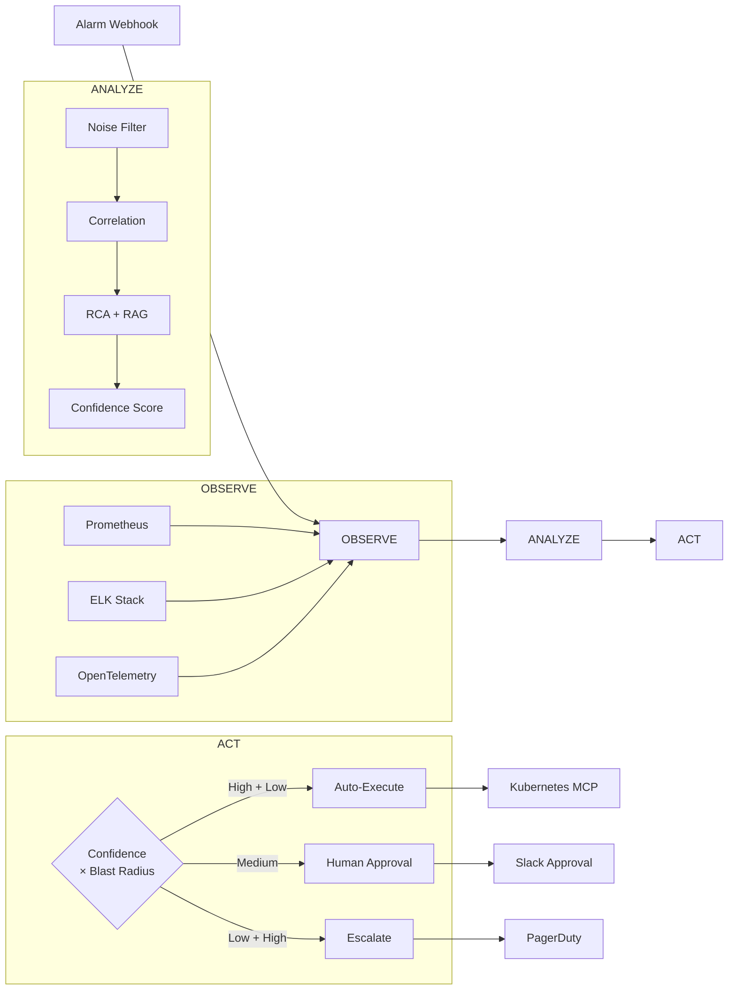
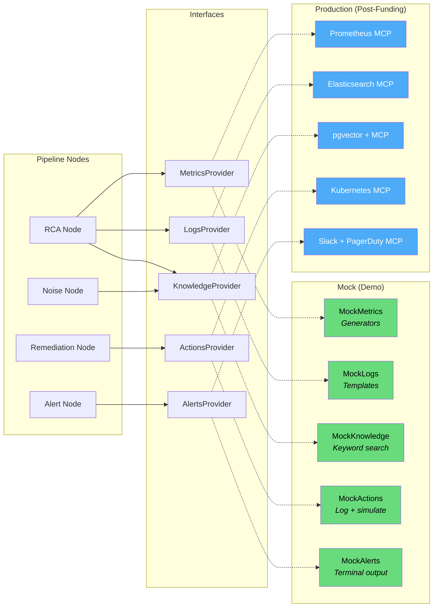
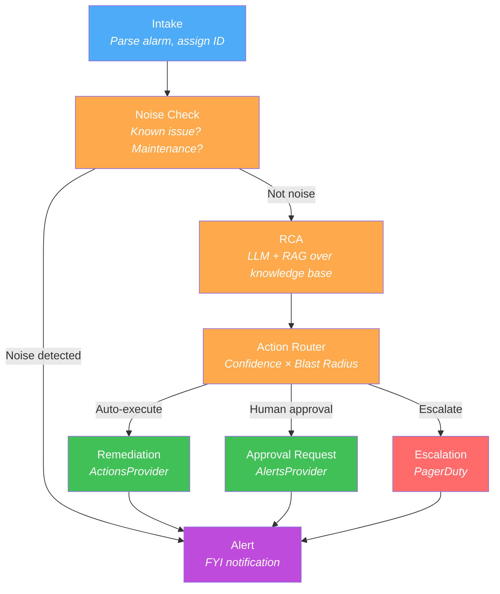
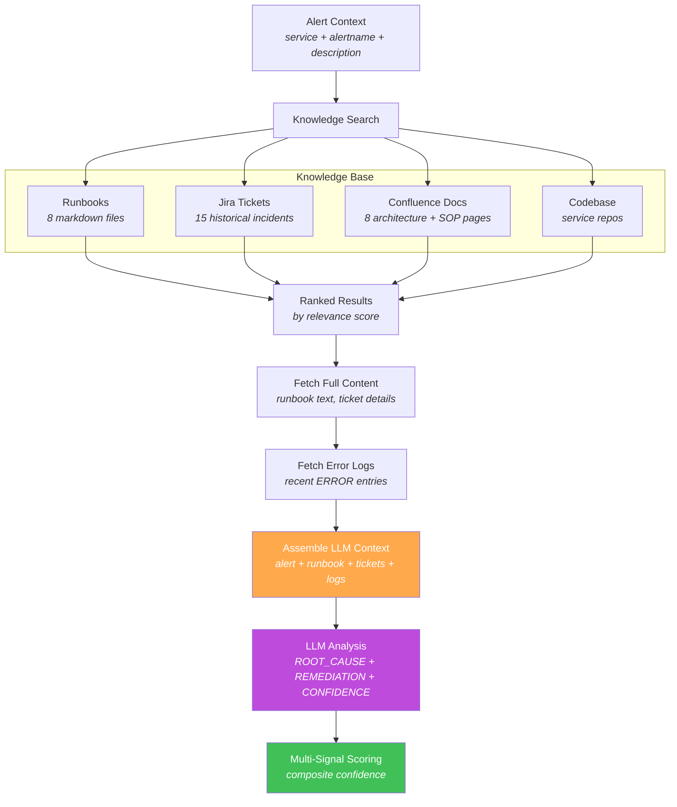
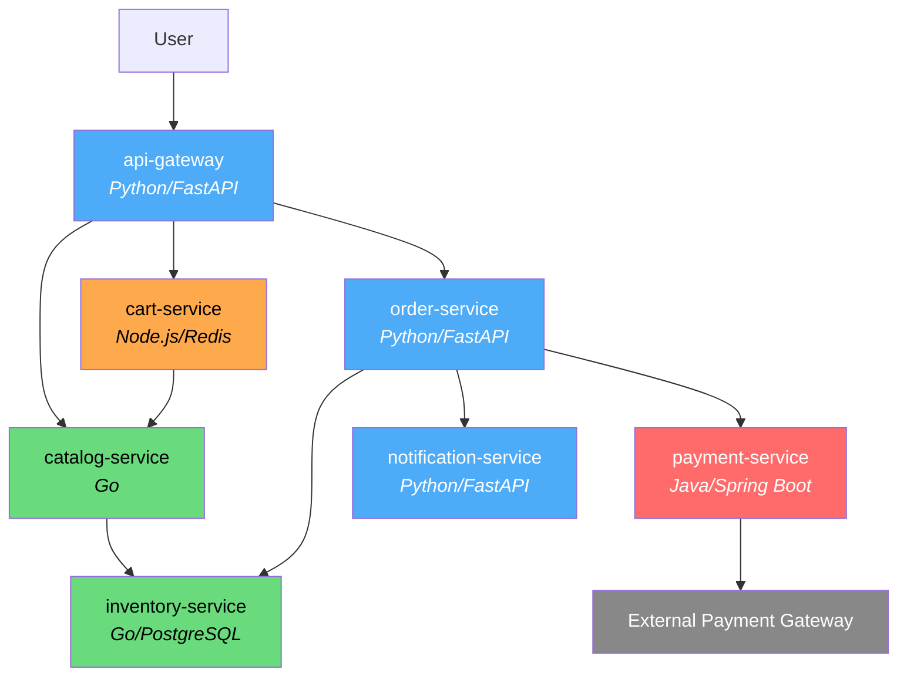
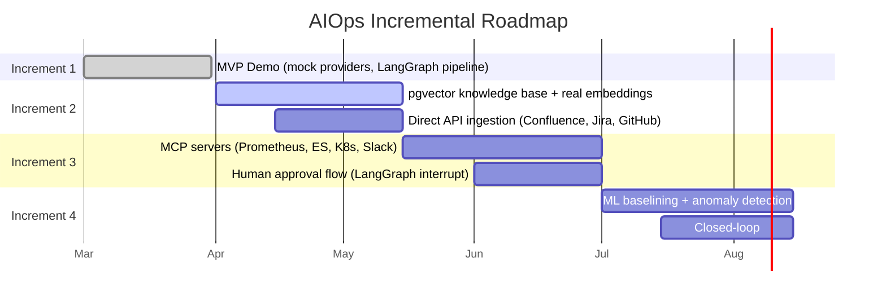

# AIOps Platform

Intelligent operations platform that moves from manual ops to automated AIOps through three pillars: **Observe → Analyze → Act**.

## Vision

**Current state:** Alarms fire → Sev 2 Jira tickets created → on-call engineer searches runbooks → manual remediation. Heavy reliance on tribal knowledge.

**Target state:** Alarms fire → AI analyzes with full context (runbooks, past incidents, correlated signals) → suggests or auto-executes remediation.

## Quick Start — Demo

The MVP demo runs end-to-end with mock data. No infrastructure, no API keys, no Docker.

```bash
# Setup
git clone https://github.com/SreeGD/aiops.git && cd aiops
uv venv .venv && source .venv/bin/activate
uv pip install -e ".[dev]"

# CLI demo
python demo.py --list                              # list 5 incident scenarios
python demo.py --mock-llm                          # run with mock LLM (no API key)
python demo.py                                     # run with real Claude (needs ANTHROPIC_API_KEY)
python demo.py --scenario all --mock-llm           # run all 5 scenarios

# Visual demo (Streamlit)
pip install streamlit plotly
streamlit run streamlit_demo.py
```

### What the Demo Shows

An alarm fires → the AI pipeline:
1. **Checks for noise** — is this a known issue or false alarm?
2. **Searches knowledge base** — finds matching runbook, similar past incidents, architecture docs
3. **Produces root cause analysis** — natural language explanation with evidence
4. **Decides action** — auto-execute (high confidence + low risk) or request human approval
5. **Executes remediation** — restarts the service, sends notification

Before: 33 min, 8 manual steps, engineer woken at 3 AM.
After: <10 sec, fully automated, engineer sleeps.

### 5 Incident Scenarios

| Scenario | Service | What Happens | Decision |
|----------|---------|-------------|----------|
| DB Pool Exhaustion | order-service | Connection pool saturates → 500 errors | Auto-execute restart |
| Payment Timeout Cascade | payment-service | External gateway slow → cascading timeouts | Human approval (medium blast) |
| JVM Memory Leak | payment-service | Heap drifts over hours → GC pauses | Human approval (lower confidence) |
| Redis Connection Storm | cart-service | Redis pool spikes to max → cart failures | Auto-execute restart |
| Slow Query Cascade | inventory-service | Missing index → cascades to 3 upstream services | Human approval (lower confidence) |

## Architecture

### High-Level Flow



### Three Pillars

#### 1. Observe (Integrate with existing tools)
- **Metrics** — Prometheus
- **Logs** — Fluentd / ELK Stack
- **Traces** — OpenTelemetry

#### 2. Analyze (The Brain)
Six-step intelligence pipeline powered by LangGraph:

1. **Baselining** — Define normal behavior (ML)
2. **Detection** — Find anomalies against baselines (ML)
3. **Noise Management** — Filter false alarms, reduce alert fatigue (LLM)
4. **Correlation** — Correlate across metrics, logs, and traces (LLM)
5. **RCA** — Root cause analysis with natural language output (LLM + RAG over runbooks/Jira)
6. **Prediction** — Forecast issues from historical patterns (ML)

#### 3. Act (Alerting + Remediation)
- **Alerting** — Deduplicated, correlated alerts with RCA context and runbook steps attached
- **Remediation** — Confidence-based routing: auto-execute low-risk actions, human approval for high-risk

### Provider Pattern

All external data access goes through abstract interfaces. Mock implementations for demo, real implementations (MCP-backed) swap in independently post-funding.



5 providers: `MetricsProvider`, `LogsProvider`, `KnowledgeProvider`, `ActionsProvider`, `AlertsProvider`. Each independently replaceable — pipeline code never changes.

### LangGraph Pipeline



### RAG Flow (Knowledge Retrieval)



### Multi-Signal Confidence Scoring

Routing decisions use a composite score (not just LLM self-assessment):

| Signal | Weight | Source |
|--------|--------|--------|
| RAG match quality | 30% | Keyword/cosine similarity from knowledge search |
| Historical success rate | 30% | Past remediation outcomes for this pattern |
| LLM assessment | 20% | LLM self-assessed confidence |
| Recency | 20% | Days since similar incident was resolved |

Decision matrix: confidence >= 0.90 + low blast radius → auto-execute. Everything else → human approval or escalation.

### MCP Integration (Production)

For production, MCP servers provide uniform data access:

| Server | Purpose | Status |
|--------|---------|--------|
| Atlassian MCP | Jira + Confluence queries | Custom build needed |
| GitHub MCP | Codebase context | Off-the-shelf |
| Prometheus MCP | Live metrics | Off-the-shelf |
| Elasticsearch MCP | Log search | Off-the-shelf |
| Kubernetes MCP | Pod restart, scaling | Off-the-shelf |
| Slack MCP | Alerts + approval buttons | Off-the-shelf |
| PagerDuty MCP | Escalation | Custom build needed |

Batch ingestion (Confluence, Jira, GitHub → pgvector) uses direct API clients, not MCP.

## Tech Stack

| Layer | Technology |
|-------|-----------|
| Backend | Python, FastAPI |
| Frontend | React, TypeScript |
| Database | PostgreSQL (TimescaleDB + pgvector) |
| Agent Orchestration | LangGraph |
| Task Queue | arq (async, Redis-backed) |
| Embeddings | pgvector (RAG over runbooks and Jira tickets) |
| Remediation | MCP (Model Context Protocol) servers |

## Project Structure

```
aiops/
├── demo.py                          # CLI demo entry point
├── streamlit_demo.py                # Visual demo (Streamlit)
├── pyproject.toml
├── backend/
│   └── app/
│       ├── providers/               # Abstract interfaces (the replaceable seam)
│       │   ├── base.py              # 5 Protocol definitions
│       │   └── factory.py           # create_providers(mode="mock"|"production")
│       └── agents/
│           ├── state.py             # LangGraph AgentState
│           ├── graph.py             # StateGraph wiring
│           ├── scoring.py           # Multi-signal confidence scoring
│           └── nodes/               # Pipeline nodes (intake, noise, rca, etc.)
├── mock/
│   ├── config.py                    # ShopFast service definitions (7 microservices)
│   ├── generators/                  # Metrics, logs, trace generators
│   ├── providers/                   # Mock implementations of all 5 providers
│   ├── scenarios/                   # 5 incident scenarios
│   └── data/
│       ├── runbooks/                # 8 markdown runbooks
│       ├── jira_tickets.json        # 15 historical incident tickets
│       └── confluence_pages/        # 8 architecture + SOP docs
└── shared/
    └── openapi.yaml
```

## Mock System: ShopFast E-Commerce

The demo uses a fictional 7-microservice e-commerce platform:



Knowledge base: 8 runbooks with real kubectl/SQL commands, 15 Jira tickets with full resolution timelines, 8 Confluence pages covering architecture, SOPs, and postmortems.

## Incremental Roadmap



### Increment 1 — MVP Demo (current)
- Provider pattern with mock implementations
- LangGraph pipeline (Intake → Noise → RCA → Action Router → Remediation → Alert)
- 5 incident scenarios with mock data generators
- CLI + Streamlit demos

### Increment 2 — Real Knowledge Base
- PostgreSQL + pgvector for embeddings
- Direct API ingestion: Confluence, Jira, GitHub, runbooks → chunk → embed → pgvector
- Replace MockKnowledgeProvider with PgVectorKnowledgeProvider

### Increment 3 — Real Observability + Remediation
- MCP servers: Prometheus, Elasticsearch, Kubernetes, Slack
- Custom MCP: Atlassian, PagerDuty
- Replace remaining mock providers with MCP-backed providers
- Human approval flow (Slack buttons + LangGraph interrupt)

### Increment 4 — ML + Full Pipeline
- ML baselining and anomaly detection
- Cross-service correlation
- Prediction / forecasting
- Closed-loop: verify fix → feed back into knowledge base

## Use Cases

1. **Intelligent Alert Triage** — Filter noise, correlate 100 alerts into 3 real incidents
2. **Automated Root Cause Analysis** — RCA in seconds via RAG over runbooks, Jira, Confluence, codebase
3. **Self-Healing Infrastructure** — Auto-remediate known low-risk patterns via Kubernetes MCP
4. **Knowledge Capture & Retention** — Institutional knowledge survives team turnover
5. **MTTR Reduction** — From ~30 min (manual) to <10 sec (automated)
6. **Proactive Incident Prevention** — Prediction node spots trends before they become outages
7. **On-Call Engineer Augmentation** — Full context at 3 AM: root cause, similar incidents, runbook steps
8. **Alert Fatigue Elimination** — Noise management + correlation reduces alert volume 60-80%
9. **Cross-Service Incident Correlation** — One unified incident instead of separate tickets per team
10. **Compliance & Audit Trail** — Every action logged with full evidence chain

## Architecture Details

See [architecture plan](.claude/plans/precious-jingling-stroustrup.md) for MCP integration design, async worker architecture, error handling, and observability.

See [MVP demo plan](.claude/plans/mvp-mock-data.md) for mock data design, scenario details, and provider pattern.
